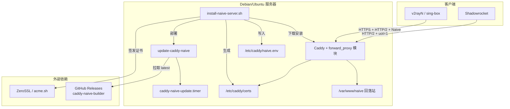
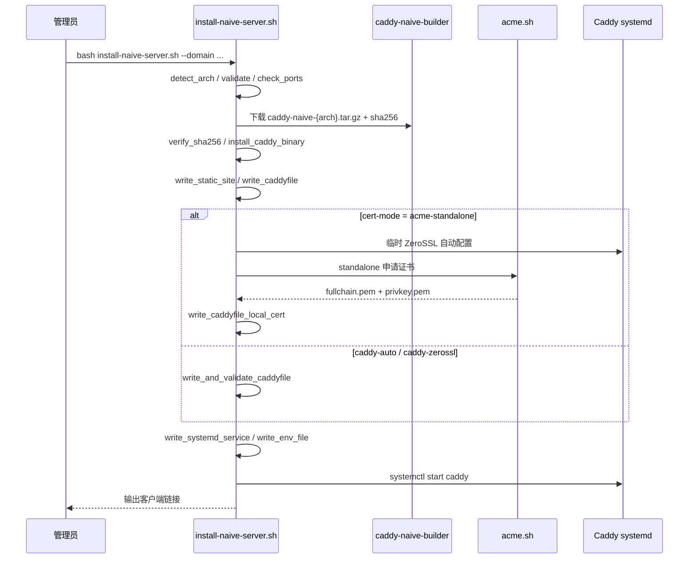
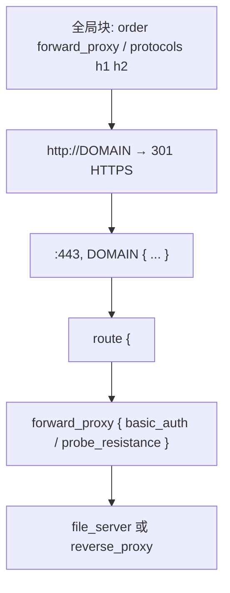
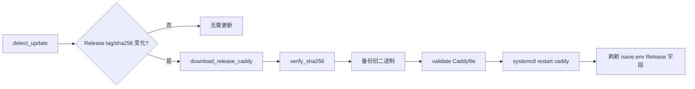

# NaiveProxy Server 架构说明

> 项目：[ike-sh/naiveproxy-server](https://github.com/ike-sh/naiveproxy-server) v1.0.1  
> 核心：单文件 Bash 管理脚本 + 预编译 Caddy naive 二进制

## 系统概览

## 安装流程

## 目录与职责

| 路径 | 职责 |
|------|------|
| `install-naive-server.sh` | 主入口：安装、菜单、诊断、卸载 |
| `lib/` | 可测试工具函数（编码、链接生成等） |
| `/usr/local/bin/caddy` | 含 `forward_proxy` 的 Caddy 二进制 |
| `/usr/local/bin/update-caddy-naive` | 内核热更新（不覆盖业务配置） |
| `/etc/caddy/Caddyfile` | 站点 + 代理核心配置 |
| `/etc/caddy/naive.env` | 安装元数据（域名、认证、Release 信息） |
| `/etc/caddy/certs/DOMAIN/` | 本地证书（acme-standalone 模式） |
| `/var/www/naive/` | 静态回落网站根目录 |

## Caddyfile 推荐结构

关键约束：

- `:443, DOMAIN` 中 `:443` 必须在域名前
- `forward_proxy` 必须在 `route` 内，且位于 `file_server` / `reverse_proxy` 之前
- 默认 `probe_resistance` 开启，不记录访问日志

## 更新流程

更新脚本**不会**覆盖：`Caddyfile`、证书、用户名密码、站点模式。

## 证书模式对比

| 模式 | 机制 | 适用场景 |
|------|------|----------|
| `acme-standalone`（推荐） | acme.sh + ZeroSSL standalone | 稳定性最好，需放行 TCP 80 |
| `caddy-auto` | Caddy 内置 ACME | 最简单，部分网络可能超时 |
| `caddy-zerossl` | Caddy 强制 ZeroSSL | 介于两者之间 |

证书复用：域名未变、证书有效且剩余 > 15 天时跳过重新签发。

## 模块划分（lib/）

| 模块 | 函数 |
|------|------|
| `lib/common.sh` | 日志、die、常量 |
| `lib/encoding.sh` | url_encode、caddyfile_quote、base64 |
| `lib/links.sh` | v2rayN / Shadowrocket 链接生成 |

主脚本在本地克隆时 `source lib/*.sh`；通过 `curl \| bash` 安装时使用合并后的单文件版本。
